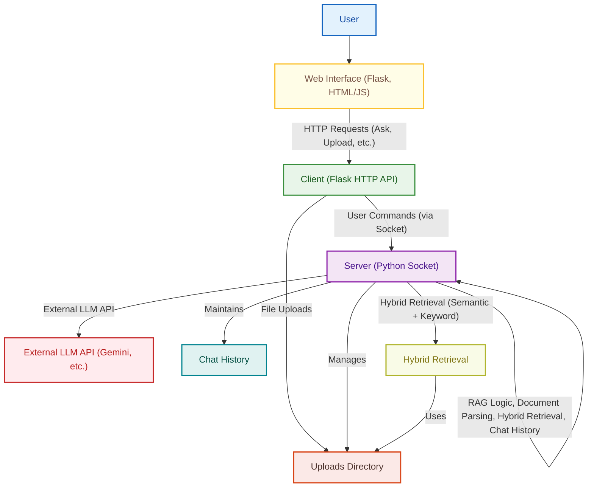

```mermaid
graph TD
    User[User]:::user
    User --> WebUI["Web Interface (Flask, HTML/JS)"]:::web
    WebUI -- "HTTP Requests (Ask, Upload, etc.)" --> Client["Client (Flask HTTP API)"]:::client
    Client -- "File Uploads" --> Uploads["Uploads Directory"]:::storage
    Client -- "User Commands (via Socket)" --> Server["Server (Python Socket)"]:::server
    Server -- "RAG Logic, Document Parsing, Hybrid Retrieval, Chat History" --> Server
    Server -- "External LLM API" --> LLMAPI["External LLM API (Gemini, etc.)"]:::llm
    Server -- "Manages" --> Uploads
    Server -- "Maintains" --> ChatHistory["Chat History"]:::history
    Server -- "Hybrid Retrieval (Semantic + Keyword)" --> Retrieval["Hybrid Retrieval"]:::retrieval
    Retrieval -- "Uses" --> Uploads

    classDef user fill:#e3f2fd,stroke:#1565c0,stroke-width:2px,color:#0d47a1;
    classDef web fill:#fffde7,stroke:#fbc02d,stroke-width:2px,color:#795548;
    classDef client fill:#e8f5e9,stroke:#388e3c,stroke-width:2px,color:#1b5e20;
    classDef server fill:#f3e5f5,stroke:#8e24aa,stroke-width:2px,color:#4a148c;
    classDef llm fill:#ffebee,stroke:#c62828,stroke-width:2px,color:#b71c1c;
    classDef storage fill:#fbe9e7,stroke:#d84315,stroke-width:2px,color:#4e342e;
    classDef history fill:#e0f2f1,stroke:#00838f,stroke-width:2px,color:#004d40;
    classDef retrieval fill:#f9fbe7,stroke:#afb42b,stroke-width:2px,color:#827717;
```
