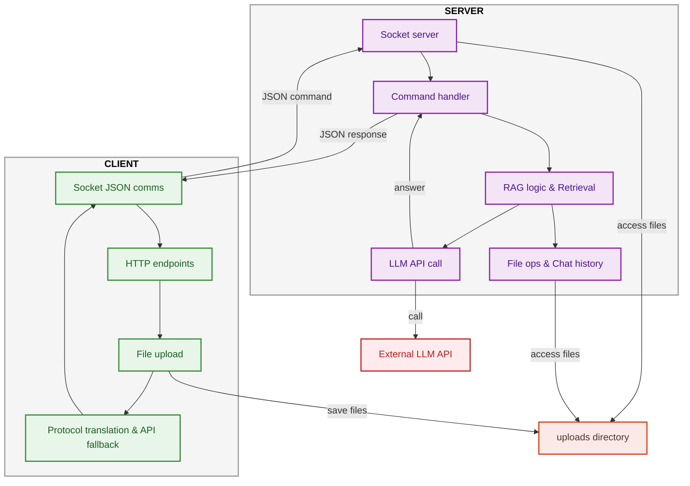

```mermaid
flowchart TD
    %% Server side (left column)
    subgraph ServerContainer ["<div style='text-align:left; color:black; font-size:16px;'><b>SERVER</b></div>"]
        direction TB
        S1[Socket server]:::server
        S2[Command handler]:::server
        S3[RAG logic & Retrieval]:::server
        S4[LLM API call]:::server
        S5[File ops & Chat history]:::server
    end
    %% Client side (right column)
    subgraph ClientContainer ["<span style='color:black;font-size:16px';text-align:left><b>CLIENT</b></span>"]
        direction TB
        C1[HTTP endpoints]:::client
        C2[File upload]:::client
        C3[Protocol translation & API fallback]:::client
        C4[Socket JSON comms]:::client
    end
    %% Connections (columnar)
    C1 --> C2
    C2 --> C3
    C3 --> C4
    C4 -- JSON command --> S1
    S1 --> S2
    S2 --> S3
    S3 --> S4
    S3 --> S5
    S4 -- answer --> S2
    S2 -- JSON response --> C4
    C4 --> C1
    C2 -- save files --> Uploads[uploads directory]:::storage
    S1 -- access files --> Uploads
    S5 -- access files --> Uploads
    S4 -- call --> LLMAPI[External LLM API]:::llm

    classDef user fill:#e3f2fd,stroke:#1565c0,stroke-width:2px,color:#0d47a1;
    classDef web fill:#f0f0f0,stroke:#bdbdbd,stroke-width:2px,color:#795548;
    classDef client fill:#e8f5e9,stroke:#388e3c,stroke-width:2px,color:#1b5e20;
    classDef server fill:#f3e5f5,stroke:#8e24aa,stroke-width:2px,color:#4a148c;
    classDef llm fill:#ffebee,stroke:#c62828,stroke-width:2px,color:#b71c1c;
    classDef storage fill:#fbe9e7,stroke:#d84315,stroke-width:2px,color:#4e342e;
    classDef history fill:#e0f2f1,stroke:#00838f,stroke-width:2px,color:#004d40;
    classDef retrieval fill:#f9fbe7,stroke:#afb42b,stroke-width:2px,color:#827717;

    %% Direct styling for subgraphs
    style ServerContainer fill:#f5f5f5,stroke:#9e9e9e,stroke-width:2px
    style ClientContainer fill:#f5f5f5,stroke:#9e9e9e,stroke-width:2px
```
