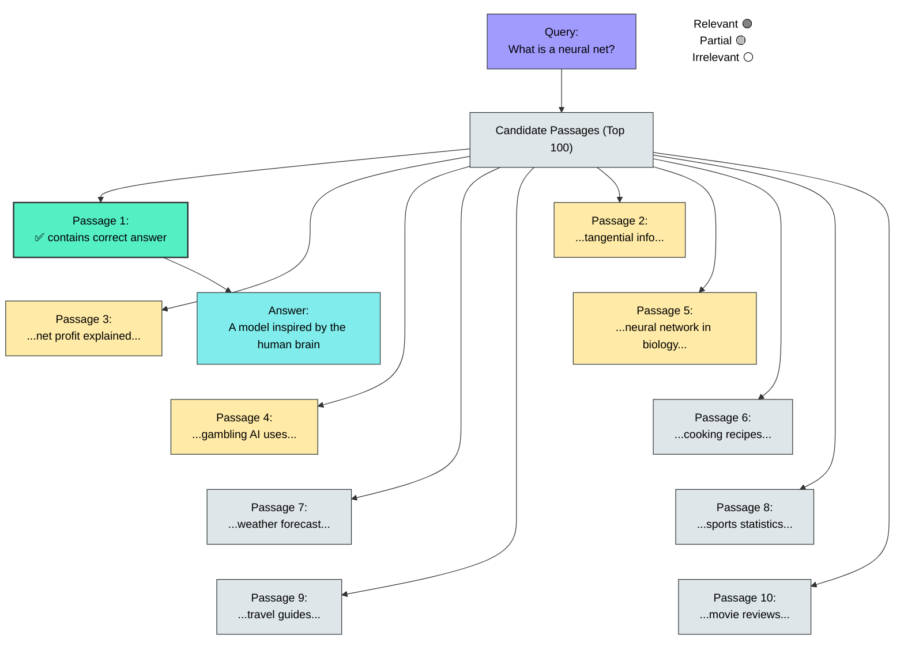

```mermaid
graph TD
    A["Query:<br/>What is a neural net?"]

    A --> B["Candidate Passages (Top 100)"]

    %% Top row passages
    B --> B1["Passage 1:<br/>✅ contains correct answer"]
    B --> B3["Passage 3:<br/>...net profit explained..."]
    B --> B4["Passage 4:<br/>...gambling AI uses..."]
    B --> B7["Passage 7:<br/>...weather forecast..."]
    B --> B9["Passage 9:<br/>...travel guides..."]

    %% Bottom row passages
    B --> B2["Passage 2:<br/>...tangential info..."]
    B --> B5["Passage 5:<br/>...neural network in biology..."]
    B --> B6["Passage 6:<br/>...cooking recipes..."]
    B --> B8["Passage 8:<br/>...sports statistics..."]
    B --> B10["Passage 10:<br/>...movie reviews..."]

    %% Force horizontal alignment for rows
    B1 --- B3
    B3 --- B4
    B4 --- B7
    B7 --- B9

    B2 --- B5
    B5 --- B6
    B6 --- B8
    B8 --- B10

    B1 --> C["Answer:<br/>A model inspired by the human brain"]

    %% Legend (right-aligned, no background)
    L["Relevant 🟢<br/>Partial 🟡<br/>Irrelevant ⚪"]

    style A fill:#a29bfe,stroke:#2d3436,color:#000000
    style B fill:#dfe6e9,stroke:#2d3436,color:#000000
    style B1 fill:#55efc4,stroke:#2d3436,stroke-width:2px,color:#000000
    style B2 fill:#ffeaa7,stroke:#2d3436,color:#000000
    style B3 fill:#ffeaa7,stroke:#2d3436,color:#000000
    style B4 fill:#ffeaa7,stroke:#2d3436,color:#000000
    style B5 fill:#ffeaa7,stroke:#2d3436,color:#000000
    style B6 fill:#dfe6e9,stroke:#2d3436,color:#000000
    style B7 fill:#dfe6e9,stroke:#2d3436,color:#000000
    style B8 fill:#dfe6e9,stroke:#2d3436,color:#000000
    style B9 fill:#dfe6e9,stroke:#2d3436,color:#000000
    style B10 fill:#dfe6e9,stroke:#2d3436,color:#000000
    style C fill:#81ecec,stroke:#2d3436,color:#000000
    style L stroke:none,fill:none,color:#000000

    %% Hide alignment lines
    linkStyle 11 stroke:none,fill:none
    linkStyle 12 stroke:none,fill:none
    linkStyle 13 stroke:none,fill:none
    linkStyle 14 stroke:none,fill:none
    linkStyle 15 stroke:none,fill:none
    linkStyle 16 stroke:none,fill:none
    linkStyle 17 stroke:none,fill:none
    linkStyle 18 stroke:none,fill:none
```
