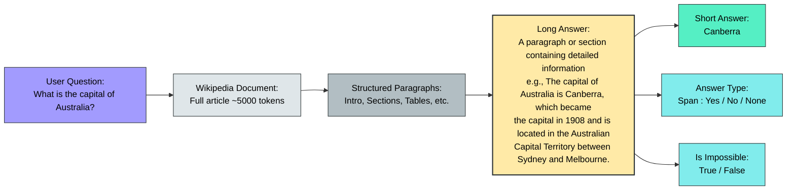

```mermaid
graph LR
    A[User Question:<br/>What is the capital of Australia?]

    A --> B[Wikipedia Document:<br/>Full article ~5000 tokens]
    B --> C[Structured Paragraphs:<br/>Intro, Sections, Tables, etc.]

    C --> D[Long Answer:<br/>A paragraph or section containing detailed information<br/>e.g., The capital of Australia is Canberra, which became<br/>the capital in 1908 and is located in the Australian<br/>Capital Territory between Sydney and Melbourne.]

    D --> E[Short Answer:<br/>Canberra]
    D --> F[Answer Type:<br/>Span : Yes / No / None]
    D --> G[Is Impossible:<br/>True / False]
      %% Force vertical stacking of B and C
    B -.-> C

    style A fill:#a29bfe,stroke:#2d3436,color:#000000
    style B fill:#dfe6e9,stroke:#2d3436,color:#000000
    style C fill:#b2bec3,stroke:#2d3436,color:#000000
    style D fill:#ffeaa7,stroke:#2d3436,stroke-width:2px,color:#000000
    style E fill:#55efc4,stroke:#2d3436,color:#000000
    style F fill:#81ecec,stroke:#2d3436,color:#000000
    style G fill:#81ecec,stroke:#2d3436,color:#000000

    %% Hide the alignment line
    linkStyle 6 stroke:none,fill:none
```
