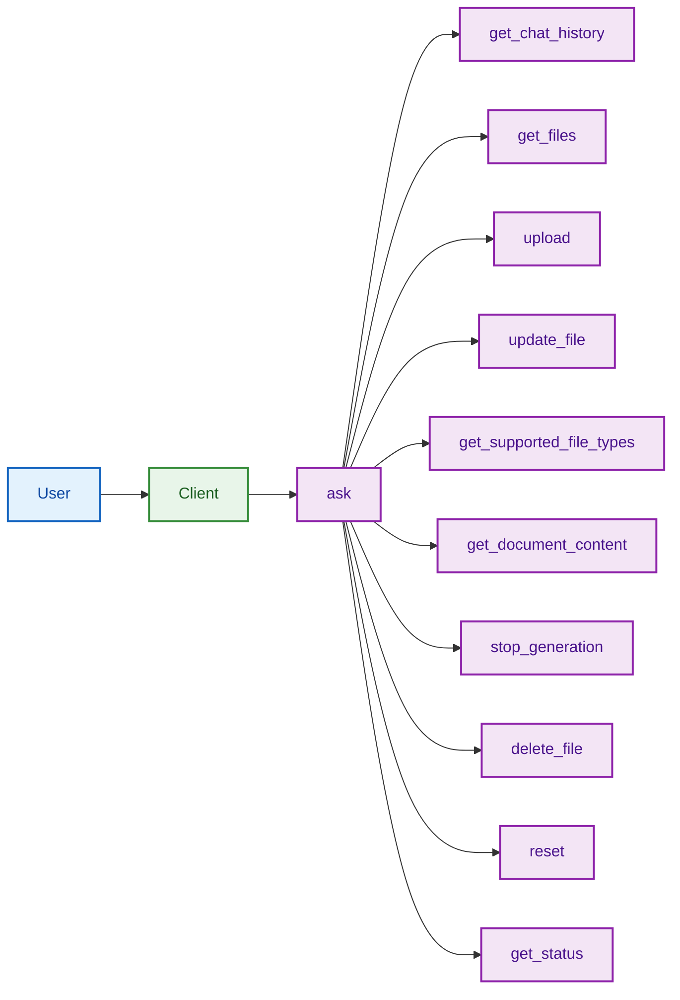

<!--
Main interaction flow for the RAG chatbot system:
- Only the main command (ask) is directly connected to the Client.
- All other commands are shown as arrows branching from the main command (ask), visually emphasizing ask as the central hub.
-->

