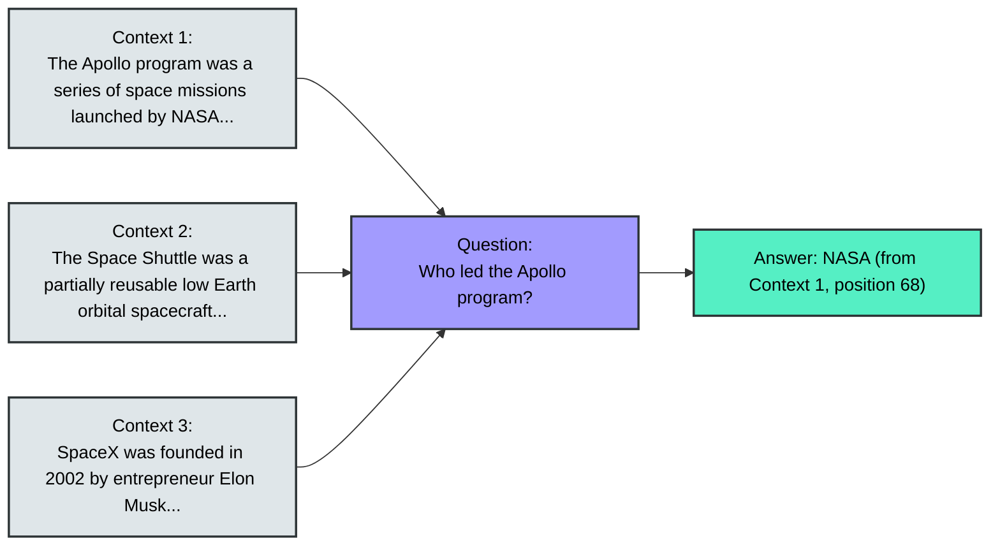

```mermaid
graph LR
    A1["Context 1:<br/>The Apollo program was a series of space missions launched by NASA..."]
    A2["Context 2:<br/>The Space Shuttle was a partially reusable low Earth orbital spacecraft..."]
    A3["Context 3:<br/>SpaceX was founded in 2002 by entrepreneur Elon Musk..."]

    A1 --> B["Question:<br/>Who led the Apollo program?"]
    A2 --> B
    A3 --> B

    B --> C["Answer: NASA (from Context 1, position 68)"]

    style A1 fill:#dfe6e9,stroke:#2d3436,stroke-width:2px,color:#000000
    style A2 fill:#dfe6e9,stroke:#2d3436,stroke-width:2px,color:#000000
    style A3 fill:#dfe6e9,stroke:#2d3436,stroke-width:2px,color:#000000
    style B fill:#a29bfe,stroke:#2d3436,stroke-width:2px,color:#000000
    style C fill:#55efc4,stroke:#2d3436,stroke-width:2px,color:#000000
```
